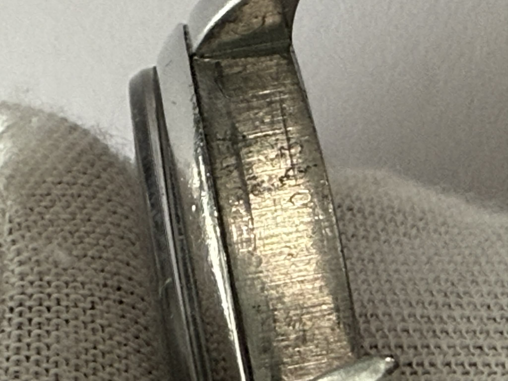
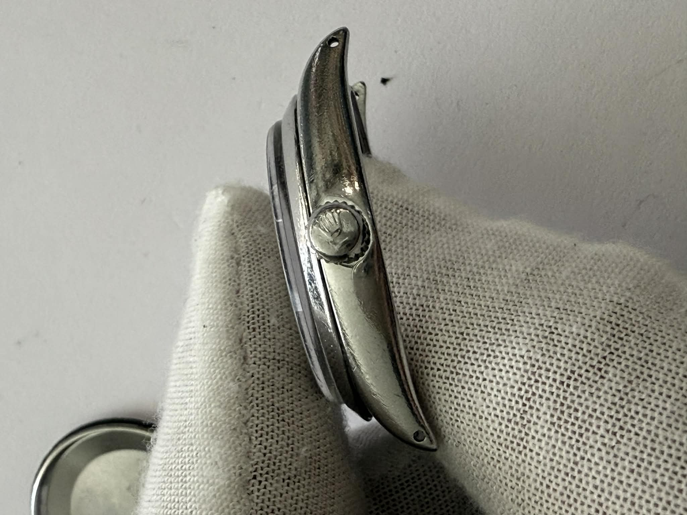
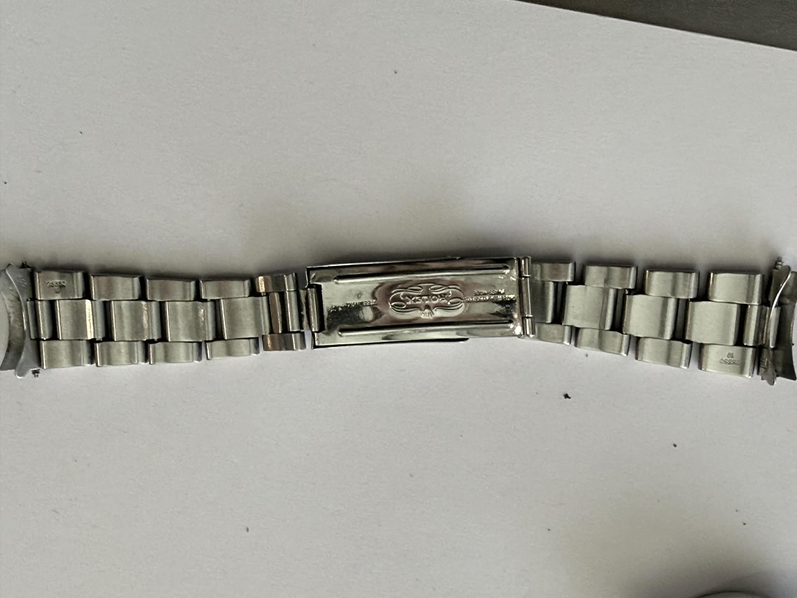
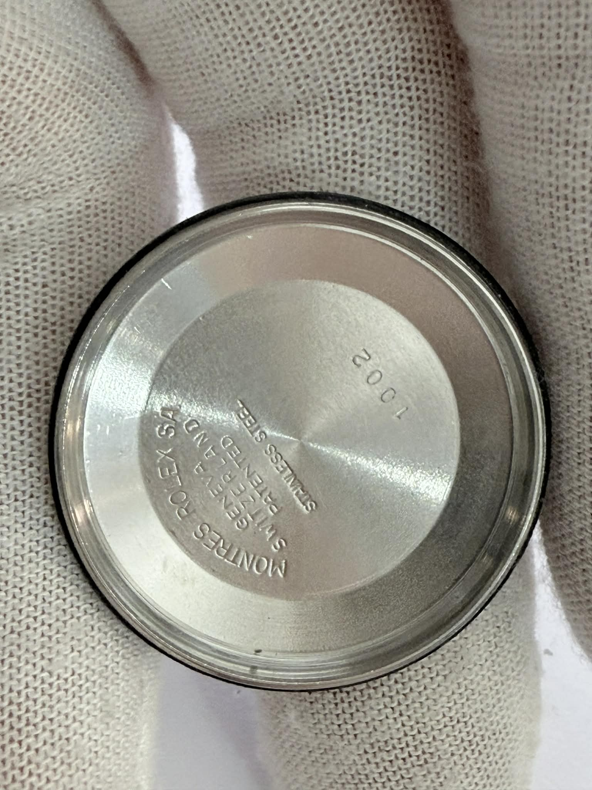
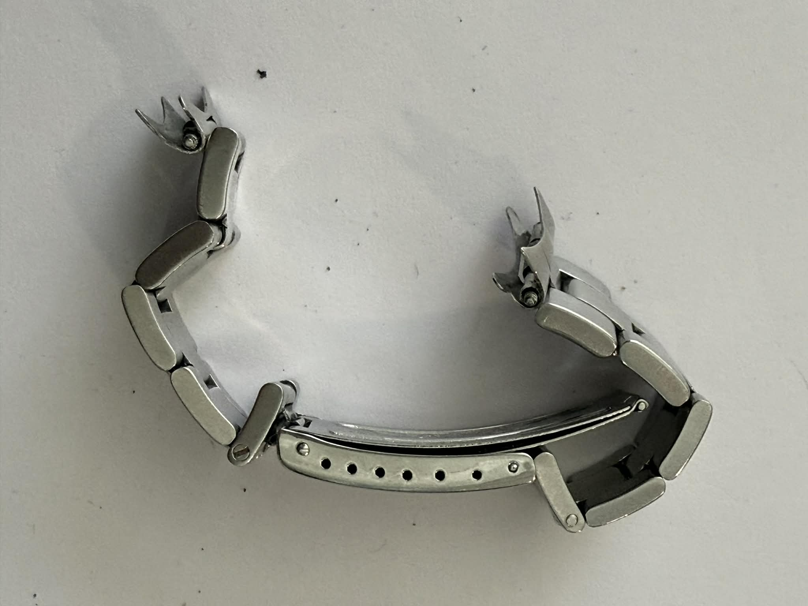

# FOR SALE: Rolex Oyster Case 34mm – Compatible with Caliber 1570
Includes Crystal, Crown, Hands & Bracelet Ref. 78350

Up for sale is an original Rolex Oyster stainless steel case (34mm) suitable for builds or restorations using the Rolex Caliber 1570 movement.

## What’s Included:
- *Rolex Oyster Case – 34mm*
  - Original stainless steel
  - No structural damage
  - Sharp profile, clean lugs

- *Acrylic Crystal*
  - Installed, good condition

- *Rolex Crown*
  - Original crown with Rolex logo
  - Functional

- *Hands Set*
  - Vintage original hands
  - Natural aging/patina

- *Rolex Bracelet Ref. 78350*
  - Original bracelet
  - Noticeable stretch (typical for vintage)
  - Signed clasp

## Condition:
- Case: Very good for its age
- Crystal: Clean
- Crown: Working
- Hands: Vintage patina
- Bracelet: Worn/stretch, but original

## Ideal For:
- Watchmakers restoring a Rolex with Caliber 1570
- Collectors looking for genuine vintage parts
- Replacement components or vintage builds
